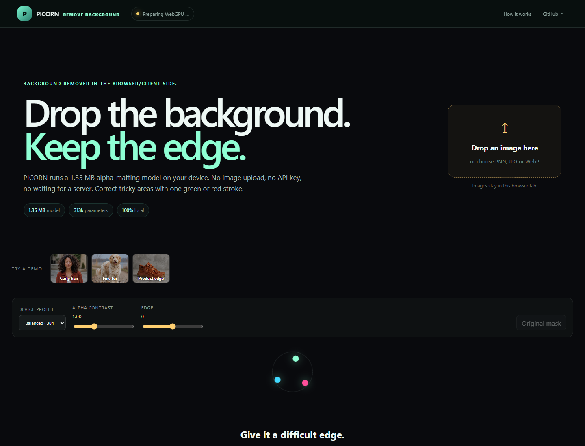

<p align="center">
  <strong>PICORN Remove Background</strong><br>
  Background remover in the Browser/Client side.
</p>

<p align="center">
  <a href="https://cueqzapper.github.io/PICORN-Background-Remover/"><strong>Try the live demo</strong></a>
  ·
  <a href="#run-it-locally">Run locally</a>
  ·
  <a href="#how-the-refine-brush-works">Smart refine</a>
</p>

PICORN removes image backgrounds without sending the image to a server. The
model, inference runtime, alpha correction and PNG export all run in the browser.



The shipped V9 ONNX model is **1.35 MB** and has **312,878 inference parameters**.
It uses WebGPU when the browser supports it and falls back to WASM on the CPU.

## What you can do

- Drop in a PNG, JPG or WebP. Nothing is uploaded.
- Choose 320, 384 or 512 px inference profiles for different devices.
- Inspect the edge on a checkerboard, solid color or gradient.
- Paint green to restore a missing region or red to remove a leftover region.
- Download the cutout, a composite or the alpha matte as PNG.
- Run the same static build on GitHub Pages, a CDN or your own machine.

## Why it is small

PICORN does not put a large general-purpose vision backbone in the browser. Its
ONNX graph combines a compact semantic encoder with dynamic foreground and
background prototypes, multi-scale texture signals and a shallow full-resolution
detail path. It predicts a soft alpha matte, not just a binary object mask.

The result is one model file with 988 ONNX nodes and 146 initializers. There is
no Python service behind the demo.

## V9 model update

V9 improves the matte without adding layers, parameters or browser code. It is
the same compact graph, fine-tuned once more at a low learning rate.

On the full 6,489-image validation set (DIS5K, DUTS-TE and P3M):

| Metric | V8 | V9 |
| --- | ---: | ---: |
| Intersection over Union | 0.59233 | **0.59294** |
| Mean absolute error | 0.07515 | **0.07449** |
| Boundary F1 | 0.38206 | **0.38432** |

The update is deliberately small. V9 improves the aggregate score, edges and
alpha error while keeping the 1,417,388-byte artifact unchanged. See the
[V9 research notes](docs/model-v9.md) for the per-dataset results and rejected
experiments.

## How the refine brush works

The brush is more than a round paint stamp:

1. The current alpha matte supplies confident foreground and background anchors.
2. A green or red stroke becomes a local trimap hint.
3. Color, gradient and Shannon-entropy differences decide how far that hint may
   travel through the connected region.
4. Small mask islands and enclosed holes can be corrected as complete components.
5. A guided filter pulls the new soft alpha back onto the visible image edge.

Only the narrow painted core is a hard instruction. The grown selection stays a
soft proposal, and the correction is limited to a local band. This prevents one
small hint from replacing most of an otherwise good mask.

## Run it locally

You need Node.js 22 or newer.

```bash
git clone https://github.com/cueqzapper/PICORN-Background-Remover.git
cd PICORN-Background-Remover
npm install
npm run dev
```

Open `http://127.0.0.1:4185/`.

For a production build:

```bash
npm test
npm run check
npm run build
npm run preview
```

## Browser support

| Browser | Preferred path | Fallback |
| --- | --- | --- |
| Chrome / Edge | WebGPU | WASM |
| Firefox | WASM | — |
| Safari | WebGPU where available | WASM |

The page becomes interactive before the runtime is warm. On first use, the
browser downloads and caches the model and the relevant ONNX Runtime files.
Later runs reuse the browser cache. Modern Chromium browsers use the smaller
JSPI WebGPU runtime; older WebGPU implementations retain a compatible fallback.

## Project layout

```text
public/models/                 PICORN ONNX model
public/demo/                   CC0 demo images
src/browser-runtime.js         ONNX loading, preprocessing and guidance inputs
src/interactive-matting.js     Trimap, geodesic growth and guided refinement
src/main.js                    Demo interaction, rendering and PNG export
tests/                         Runtime and smart-refine regression tests
```

## Limits

The model deliberately trades broad model capacity for size and client-side
speed. Extremely crowded scenes, transparent glass, motion blur and subjects
whose color matches the background can still need a refine stroke. The Quality
profile improves thin structures, but it also does more work.

## Licenses

- Browser source code: [MIT](LICENSE)
- Included PICORN ONNX weights: [separate model terms](MODEL_LICENSE.md)
- Included demo images: [CC0 1.0](DEMO_ASSETS.md)
- ONNX Runtime Web is installed from npm and retains its [MIT notice](public/THIRD_PARTY_NOTICES.txt).

If you want to use the weights in a commercial product or hosted service,
contact PICORN for a commercial model license.
